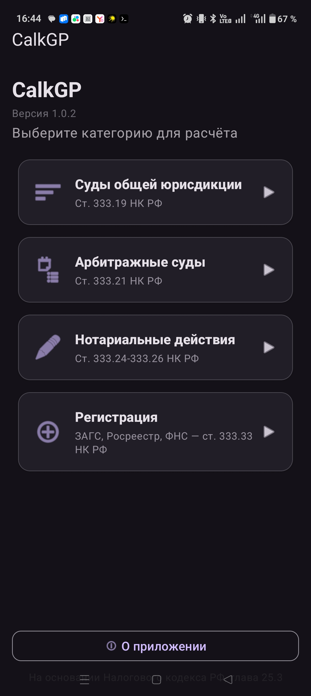
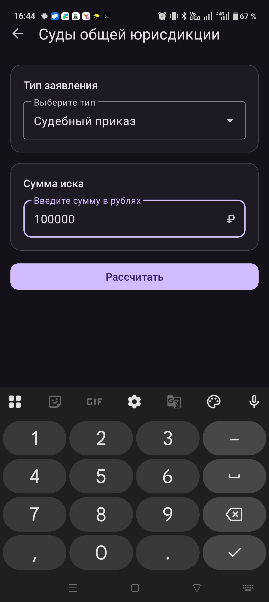
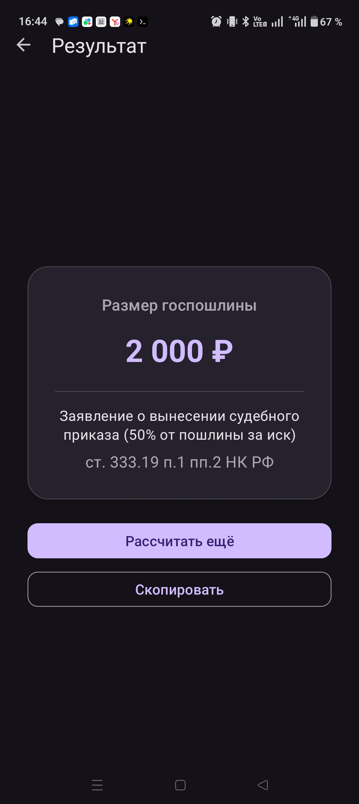

# CalkGP — Калькулятор государственной пошлины РФ

> [English version below](#calkgp--russian-state-duty-calculator)

Android-приложение для расчёта государственной пошлины на основании главы 25.3 Налогового кодекса Российской Федерации.

## О проекте

**CalkGP** — мобильный калькулятор государственной пошлины Российской Федерации. Приложение позволяет за несколько секунд рассчитать размер госпошлины по всем основным категориям, предусмотренным главой 25.3 Налогового кодекса РФ, без необходимости искать актуальные тарифы вручную.

### Зачем

Размер государственной пошлины зависит от типа обращения, суммы иска и инстанции. Тарифы установлены в разных статьях НК РФ, а расчёт для имущественных требований выполняется по многоступенчатой формуле. CalkGP сводит всё в один экран: выбрать категорию — ввести сумму — получить результат со ссылкой на конкретный пункт закона.

### Архитектура

Приложение построено по стандартной архитектуре Android с одним `Activity` и набором `Fragment`-ов, связанных через Jetpack Navigation:

- **UI-слой** — фрагменты для каждой категории (суды, арбитраж, нотариат, регистрация) и экран результата
- **Бизнес-логика** — `DutyCalculator` содержит все формулы расчёта по статьям 333.19, 333.21, 333.24–333.26, 333.33 НК РФ
- **ViewBinding** — типобезопасный доступ к элементам интерфейса без лишнего boilerplate

### Технологии

| Компонент | Технология |
|---|---|
| Язык | Kotlin |
| UI | Material Design 3, Jetpack Navigation |
| Сборка | Gradle (Kotlin DSL), AGP 8.7.3 |
| CI/CD | GitHub Actions — автоматическая сборка и публикация релизов |
| Минимальная версия | Android 8.0 (API 26) |
| Целевая версия | Android 15 (API 35) |

## Скриншоты

| Главный экран | Расчёт пошлины |
|:---:|:---:|
|  |  |

| Результат | О приложении |
|:---:|:---:|
|  |  |

## Возможности

- **Суды общей юрисдикции** — ст. 333.19 НК РФ: имущественные иски, судебные приказы, расторжение брака, апелляции, кассации и другие виды заявлений
- **Арбитражные суды** — ст. 333.21 НК РФ: имущественные иски, банкротство, судебные приказы, жалобы
- **Нотариальные действия** — ст. 333.24–333.26 НК РФ: доверенности, завещания, наследство, удостоверение сделок
- **Регистрация** — ст. 333.33 НК РФ: ЗАГС (брак, развод, смена имени), Росреестр (права, ипотека, ДДУ, земельные участки), ФНС (ООО, ИП, ликвидация)
- Копирование результата в буфер обмена
- Ссылки на конкретные пункты НК РФ

## Установка

Скачайте последний APK из [релизов](https://github.com/polyarniq/calk-GP/releases) или соберите из исходников:

```bash
./gradlew assembleDebug
```

APK будет создан в `app/build/outputs/apk/debug/`.

## Требования

- Android 8.0 (API 26) и выше
- Kotlin, Jetpack Navigation

---

# CalkGP — Russian State Duty Calculator

Android application for calculating Russian state duties (государственная пошлина) based on Chapter 25.3 of the Tax Code of the Russian Federation.

## About

**CalkGP** is a mobile calculator for Russian state duties (государственная пошлина). It lets you instantly calculate the duty amount across all major categories defined in Chapter 25.3 of the Russian Tax Code — no need to look up rates manually.

### Why

The duty amount depends on the type of filing, the claim value, and the court instance. Rates are spread across multiple articles of the Tax Code, and property-based calculations use a multi-tier formula. CalkGP brings it all to one screen: pick a category, enter the amount, get the result with a reference to the specific legal provision.

### Architecture

The app follows a standard single-Activity architecture with Fragment-based screens connected via Jetpack Navigation:

- **UI layer** — dedicated fragments for each category (courts, arbitration, notary, registration) and a result screen
- **Business logic** — `DutyCalculator` contains all calculation formulas per Articles 333.19, 333.21, 333.24–333.26, 333.33 of the Tax Code
- **ViewBinding** — type-safe view access without boilerplate

### Tech Stack

| Component | Technology |
|---|---|
| Language | Kotlin |
| UI | Material Design 3, Jetpack Navigation |
| Build | Gradle (Kotlin DSL), AGP 8.7.3 |
| CI/CD | GitHub Actions — automated build and release publishing |
| Min SDK | Android 8.0 (API 26) |
| Target SDK | Android 15 (API 35) |

## Screenshots

| Home Screen | Duty Calculation |
|:---:|:---:|
|  |  |

| Result | About |
|:---:|:---:|
|  |  |

## Features

- **Courts of General Jurisdiction** — Art. 333.19 Tax Code: property claims, court orders, divorce, appeals, cassation complaints, and other filings
- **Arbitration Courts** — Art. 333.21 Tax Code: property claims, bankruptcy, court orders, complaints
- **Notarial Actions** — Art. 333.24–333.26 Tax Code: powers of attorney, wills, inheritance, deal certification
- **Registration** — Art. 333.33 Tax Code: Civil Registry (marriage, divorce, name change), Rosreestr (property rights, mortgages, equity agreements, land plots), Federal Tax Service (LLC, sole proprietorship, liquidation)
- Copy result to clipboard
- References to specific articles of the Russian Tax Code

## Installation

Download the latest APK from [Releases](https://github.com/polyarniq/calk-GP/releases) or build from source:

```bash
./gradlew assembleDebug
```

The APK will be at `app/build/outputs/apk/debug/`.

## Requirements

- Android 8.0 (API 26) or higher
- Kotlin, Jetpack Navigation

## Disclaimer

The application is for informational purposes only and does not constitute legal advice. For the exact duty amount, please refer to the current text of the Tax Code of the Russian Federation.

## Author

polyarniq — polyarniq@yandex.ru

## License

© 2026 polyarniq. All rights reserved.
